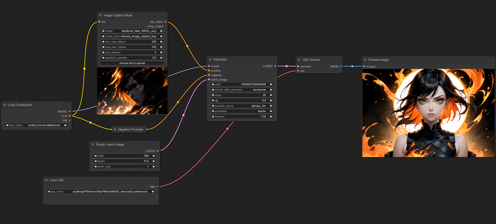
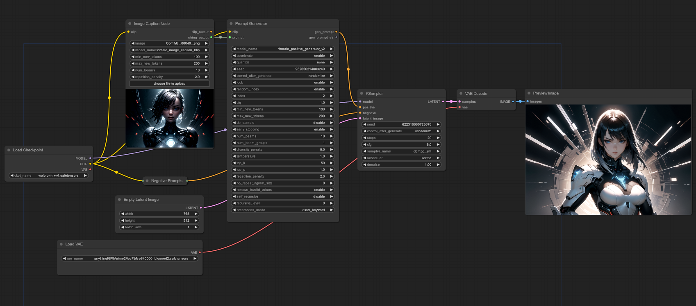
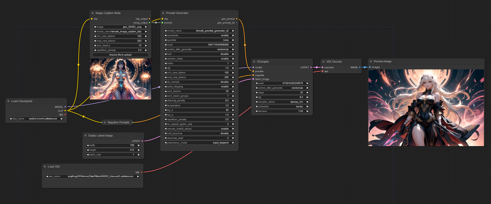

# image-caption-comfyui

- [image-caption-comfyui](#image-caption-comfyui)
  - [Setup](#setup)
  - [Example Workflow](#example-workflow)
  - [Pretrained Image Caption Models](#pretrained-image-caption-models)
    - [Models](#models)
  - [Variables](#variables)
    - [Image Caption Node](#image-caption-node)
    - [Insert Prompt Node](#insert-prompt-node)
  - [Troubleshooting](#troubleshooting)
    - [Package Version](#package-version)
    - [New Updates On The Node](#new-updates-on-the-node)
  - [Contributing](#contributing)
  - [Example Output](#example-output)

Image caption node for ComfyUI. You can load your image caption model and generate prompts with the given picture.

Insert prompt node is added here to help the users to add their prompts easily.

## Setup

- Clone the repository to the ```custom_nodes``` folder
- Run ComfyUI
- Place the folder which contains your model under the ```models/image_captioners``` folder
- Click ```Refresh``` button in ComfyUI, if it didn't work restart ComfyUI

- [x] Processor has to be in the folder

## Example Workflow







- You can find the ```Prompt Generator``` node in [this repository](https://github.com/alpertunga-bile/prompt-generator-comfyui)

## Pretrained Image Caption Models

- You can find the models in [this link](https://drive.google.com/drive/folders/1c21kMH6FTaia5C8239okL3Q0wJnnWc1N?usp=share_link)

- For to use the pretrained model follow these steps:
  - Download the model and unzip to ```models/image_captioners``` folder.
  - Click ```Refresh``` button in ComfyUI
  - Then select the image caption model with the node's ```model_name``` variable (If you can't see the generator, restart ComfyUI).

### Models

- female_image_caption_blip | **(Training In Process)**
  - Base model
  - using [Salesforce/blip-image-captioning-base](https://huggingface.co/Salesforce/blip-image-captioning-base)

## Variables

### Image Caption Node

|     Variable Names     | Definitions                                                                             |
| :--------------------: | :-------------------------------------------------------------------------------------- |
|     **model_name**     | Folder name that contains the model                                                     |
|   **min_new_tokens**   | The minimum numbers of tokens to generate, ignoring the number of tokens in the prompt. |
|   **max_new_tokens**   | The maximum numbers of tokens to generate, ignoring the number of tokens in the prompt. |
|     **num_beams**      | Number of steps for each search path                                                    |
| **repetition_penalty** | The parameter for repetition penalty. 1.0 means no penalty                              |

- For more information, follow [this link](https://huggingface.co/docs/transformers/v4.31.0/en/main_classes/text_generation#transformers.GenerationConfig).
- Check [this link](https://huggingface.co/docs/transformers/v4.31.0/en/generation_strategies#text-generation-strategies) for text generation strategies.
- [x] Increasing the ```min_new_tokens``` and ```max_new_tokens``` variables' values will help to generate more accurate prompts.

### Insert Prompt Node

| Variable Names | Definitions                                                                                                                                                                                                                                                                                                                                   |
| :------------: | :-------------------------------------------------------------------------------------------------------------------------------------------------------------------------------------------------------------------------------------------------------------------------------------------------------------------------------------------- |
| prompt_string  | Want to be inserted prompt. It is replaced with ```{prompt_string}``` part in the prompt_format variable                                                                                                                                                                                                                                      |
| prompt_format  | New prompts with including ```prompt_string``` variable's value with ```{prompt_string}``` syntax. For example, ```prompt_string``` value is ```hdr``` and ```prompt_format``` value is ```1girl, solo, {prompt_string}```. Then the output is ```1girl, solo, hdr```. The ```{prompt_string}``` syntax will be added anywhere in the string. |

- [x] After including the node, change the ```prompt_string``` variable to input
- For string output; additional comma is added for compability with other nodes which are appending new prompts for the given string, for example ```Prompt Generator```.

## Troubleshooting

- If the below solutions are not fixed your issue please create an issue with ```bug``` label

### Package Version

- The image caption node is based on [transformers](https://github.com/huggingface/transformers) package. So most of the problems may be caused from this package. For overcome these problems you can try to update package:

- For Manual Installation of the ComfyUI
  1. Activate the virtual environment if there is one.
  2. Run the ```pip install --upgrade transformers``` command.

- For Portable Installation of the ComfyUI
  1. Go to the ```ComfyUI_windows_portable``` folder.
  2. Open the command prompt in this folder.
  3. Run the ```.\python_embeded\python.exe -s -m pip install --upgrade transformers``` command.

### New Updates On The Node

- Sometimes the variables are changed with updates, so it may broke the workflow. But don't worry, you have to just delete the node in the workflow and add it again.

## Contributing

- Contributions are welcome. If you have an idea and want to implement it by yourself please follow these steps:

  1. Create a fork
  2. Pull request the fork with the description that explaining the new feature

- If you have an idea but don't know how to implement it, please create an issue with ```enhancement``` label.

- [x] The contributing can be done in several ways. You can contribute to code or to README file.

## Example Output

|         Reference (Used) Image         |              Output              |
| :------------------------------------: | :------------------------------: |
|  |  |
|  |  |
